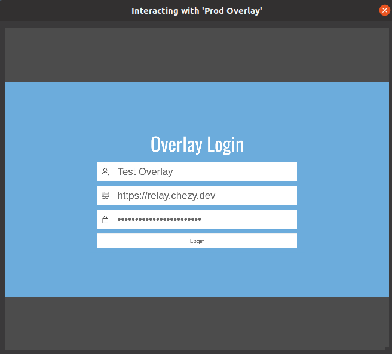
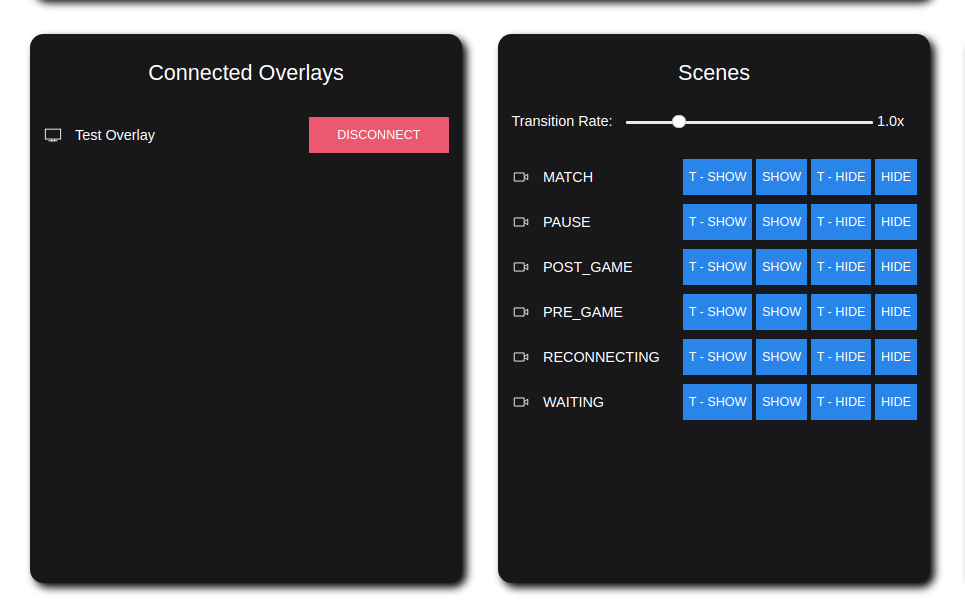
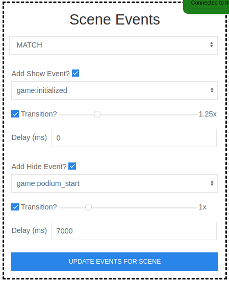
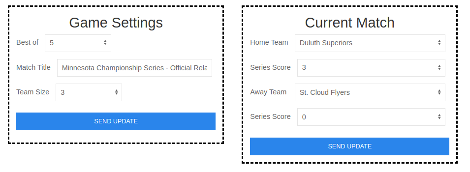
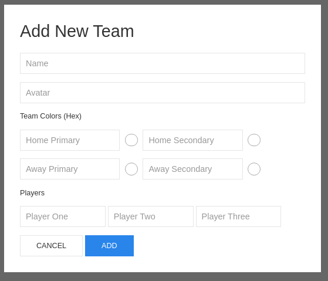

# Control Board

Welcome to the new control board! This repository holds the Node.js app that serves both the control board and the overlay. The control board allows a user to modify the teams in the relay, upload and customize scenes, and control any overlays that may be connected to it. The relay that powers all of this can be found [here](https://github.com/mn-rocket-league/rl-relay), which was written entierly in [TypeScript](https://www.typescriptlang.org).

# Installation

Use the following steps below to clone and install dependencies for the control board.

```
git clone git@github.com:mn-rocket-league/rl-control-board.git
cd rl-control-board
yarn
```

To start it, you can use either docker or just run it locally. To run it locally (port 80):
```
yarn start:dev
```
To run it with docker (port 9000):
```
yarn start:docker
```

# Overlay Setup

If you're running the control board locally on your machine, then the address you will want to put into your OBS browser source is `http://localhost/overlay`. Then, once your browser source is up, you will be greeted with a lovely login page. This is to ensure that only authorized users are allowed to use the overlay, and it also allows us to keep track of who's currently using an overlay so we can do stuff with it in the control board. To enter in your login details, right click on the browser source and select `Interact`. The name of the overlay can be whatever you'd like, but that name will be what shows up in the control board. The server you put in must point to a [relay instance](https://github.com/mn-rocket-league/rl-relay).



# Pages

Once logged in, you will have 4 different pages to work with: `MONITOR`, `SCENES`, `MATCH`, and `SETTINGS`.

## Monitor

This page contains an embed of the twitch stream (and chat), along with a list of overlays and scenes to control. 



To deactivate an overlay, just click `DISCONNECT` next to the name. After you do that, the overlay will stop itself and return to the login screen.

To show or hide scenes, there are four buttons next to each scene: `T - SHOW`, `SHOW`, `T - HIDE`, and `HIDE`.  All of the buttons do what they say, although the ones prefixed with `T - ` will play a transition then show/hide the scene. The transition rate shown at the top of the scenes list applies to all of the `T - ` buttons.

## Scenes

Here is where you will be doing all of the scene setup. You can upload your scenes, remove scenes, and modify the events where they activate/deactivate. Documentation for creating scenes can be found in the [rl-overlay repository](https://github.com/mn-rocket-league/rl-overlay).

Once you have a scene uploaded, you will want to go to the Scene Events box to set the events. It will prompt you for whether or not you want to add `show` and `hide` events, along with other useful properties. An example setup is pictured below.



## Match

The match page is used to set the match information including `bestOf`, `teamSize`, `matchTitle`, and the teams that are playing in the current match. All the information on this page gets applied immediately when you click on `SEND UPDATE`.



## Settings

As of right now this is more of just a teams page, but we'll just call it settings i guess.

This page shows you all of the teams that are currently being stored in the relay. It contains all of the official teams from the API, along with any custom teams that anyone may have added. Note that you cannot remove API teams, you are only able to remove custom teams. To add a new team, click on `+ Add New Team` at the top and fill in the details. All of the team colors you put in must be in hex format (ex. #ff9900).

